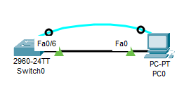
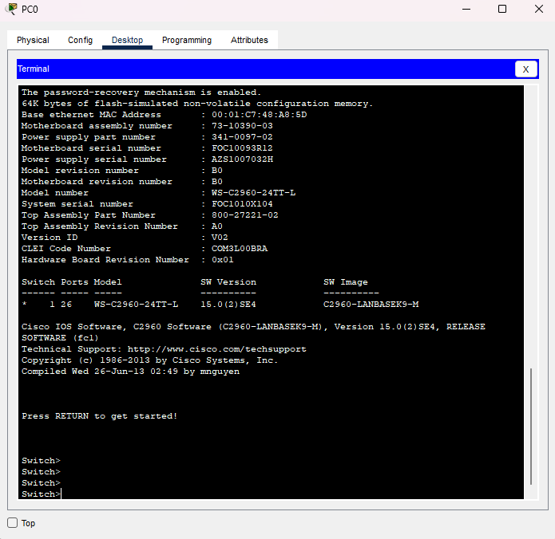

# Лабораторная работа. Базовая настройка коммутатора
## Топология

## Таблица адресации
|Устройство|Интерфейс|IP адрес   |
| ------------ | ------------ | ------------ |
| S1|Vlan 1|192.168.1.2|
|   |   |255.255.255.0|
| PC-PT|NIC|192.168.1.10|
|   |   |255.255.255.0|
## Задачи
#### Часть 1. Проверка конфигурации коммутатора по умолчанию
#### Часть 2. Создание сети и настройка основных параметров устройства
•	Настройте базовые параметры коммутатора. 
•	Настройте IP-адрес для ПК.
#### Часть 3. Проверка сетевых подключений
•	Отобразите конфигурацию устройства. 
•	Протестируйте сквозное соединение, отправив эхо-запрос. 
•	Протестируйте возможности удаленного управления с помощью Telnet.
## Часть 1. Создание сети и проверка настроек коммутатора по умолчанию
В первой части лабораторной работы вам предстоит настроить топологию сети и проверить настройку коммутатора по умолчанию.
### Шаг 1. Создайте сеть согласно топологии.
a.	Подсоедините консольный кабель, как показано в топологии. На данном этапе не подключайте кабель Ethernet компьютера PC-A. 
b.	Установите консольное подключение к коммутатору с компьютера PC-A с помощью Tera Term или другой программы эмуляции терминала.

#### Вопрос  
Почему нужно использовать консольное подключение для первоначальной настройки коммутатора? Почему нельзя подключиться к коммутатору через Telnet или SSH? 
#### Ответ  
На текущем этапе, не задан IP адрес, а также не заданы настройки авторизации для данных протоколов
###Шаг 2. Проверьте настройки коммутатора по умолчанию. 
a.	Предположим, что коммутатор не имеет файла конфигурации, сохраненного в энергонезависимой памяти (NVRAM). Консольное подключение к коммутатору с помощью Tera Term или другой программы эмуляции терминала предоставит доступ к командной строке пользовательского режима EXEC в виде Switch>. Введите команду enable, чтобы войти в привилегированный режим EXEC.
Откройте окно конфигурации
Обратите внимание, что измененная в конфигурации строка будет отражать привилегированный режим EXEC.
Убедитесь, что на коммутаторе находится пустой файл конфигурации по умолчанию, с помощью команды show running-config привилегированного режима EXEC.  Если конфигурационный файл был предварительно сохранен, его нужно удалить. В зависимости от модели коммутатора и версии IOS ваша конфигурация может слегка отличаться. Тем не менее, настроенных паролей или IP-адресов в конфигурации быть не должно. Выполните очистку настроек и перезагрузите коммутатор, если ваш коммутатор имеет настройки, отличные от настроек по умолчанию. 

Switch#show running-config  
Building configuration... 
Current configuration : 1080 bytes 
! 
version 15.0 
no service timestamps log datetime msec 
no service timestamps debug datetime msec 
no service password-encryption 
! 
hostname Switch 
! 
! 
! 
! 
! 
! 
spanning-tree mode pvst 
spanning-tree extend system-id 
! 
interface FastEthernet0/1 
! 
interface FastEthernet0/2 
! 
interface FastEthernet0/3 
! 
interface FastEthernet0/4 
! 
interface FastEthernet0/5 
! 
interface FastEthernet0/6 
! 
interface FastEthernet0/7 
! 
interface FastEthernet0/8 
! 
interface FastEthernet0/9 
! 
interface FastEthernet0/10 
! 
interface FastEthernet0/11 
! 
interface FastEthernet0/12 
! 
interface FastEthernet0/13 
! 
interface FastEthernet0/14 
! 
interface FastEthernet0/15 
! 
interface FastEthernet0/16 
! 
interface FastEthernet0/17 
! 
interface FastEthernet0/18 
! 
interface FastEthernet0/19 
! 
interface FastEthernet0/20 
! 
interface FastEthernet0/21 
! 
interface FastEthernet0/22 
! 
interface FastEthernet0/23 
! 
interface FastEthernet0/24 
! 
interface GigabitEthernet0/1 
! 
interface GigabitEthernet0/2 
! 
interface Vlan1 
no ip address 
shutdown 
! 
! 
! 
! 
line con 0 
! 
line vty 0 4 
login 
line vty 5 15 
login 
! 
! 
! 
! 
end 
b.	Изучите текущий файл running configuration.
#### Вопрос  
Сколько интерфейсов FastEthernet имеется на коммутаторе 2960? 
#### Ответ  
24
#### Вопрос  
Сколько интерфейсов Gigabit Ethernet имеется на коммутаторе 2960? 
#### Ответ  
2
#### Вопрос  
Каков диапазон значений, отображаемых в vty-линиях? 
#### Ответ  
0-15 
c.	Изучите файл загрузочной конфигурации (startup configuration), который содержится в энергонезависимом ОЗУ (NVRAM). 

Switch#show startup-config 
startup-config is not present 
#### Вопрос  
Почему появляется это сообщение? 
#### Овтет  
В энергонезависимой памяти отсутствует сохраненная конфигурация, поскольку на текущий момент конфигурация не сохранялась 

d.	Изучите характеристики SVI для VLAN 1. 
#### Вопрос  
Назначен ли IP-адрес сети VLAN 1? 
#### Ответ  
Нет, не назначен
#### Вопрос  
Какой MAC-адрес имеет SVI? Возможны различные варианты ответов. 
#### Ответ  
Switch#show interfaces vlan 1  
Hardware is CPU Interface, address is 0001.c748.a85d (bia 0001.c748.a85d) 
#### Вопрос  
Данный интерфейс включен?
#### Ответ  
Нет, не включен 

e.	Изучите IP-свойства интерфейса SVI сети VLAN 1.
#### Вопрос  
Какие выходные данные вы видите?
#### Ответ  
Название Vlan1 
Ip адрес Не задан 
Метод получения адреса Ручной 
Статус интерфейса administratively down 
Протокол down 

f.	Подсоедините кабель Ethernet компьютера PC-A к порту 6 на коммутаторе и изучите IP-свойства интерфейса SVI сети VLAN 1. Дождитесь согласования параметров скорости и дуплекса между коммутатором и ПК. 
#### Вопрос  
Какие выходные данные вы видите?
#### Ответ  
Данные не изменились
g.	Изучите сведения о версии ОС Cisco IOS на коммутаторе.
#### Вопрос  
Под управлением какой версии ОС Cisco IOS работает коммутатор? 
#### ответ  
Switch#show version  
Cisco IOS Software, C2960 Software (C2960-LANBASEK9-M), Version 15.0(2)SE4, RELEASE SOFTWARE (fc1) 
#### Вопрос  
Как называется файл образа системы? 
#### Ответ  
System image file is "flash:c2960-lanbasek9-mz.150-2.SE4.bin" 
h.	Изучите свойства по умолчанию интерфейса FastEthernet, который используется компьютером PC-A. 
Switch# show interface f0/6 
#### Вопрос  
Интерфейс включен или выключен?
Включен
Что нужно сделать, чтобы включить интерфейс?
Интерфейс включился после соединения физического соединения с ПК
Какой MAC-адрес у интерфейса?
            Switch#show interface f0/6
            FastEthernet0/6 is up, line protocol is up (connected)
Hardware is Lance, address is 0002.1681.9306 (bia 0002.1681.9306)
Какие настройки скорости и дуплекса заданы в интерфейсе?
Full-duplex, 100Mb/s
f.	Изучите флеш-память.
Выполните одну из следующих команд, чтобы изучить содержимое флеш-каталога.
Switch# show flash 
Switch# dir flash: 
В конце имени файла указано расширение, например .bin. Каталоги не имеют расширения файла.
Вопрос:
Какое имя присвоено образу Cisco IOS?
2960-lanbasek9-mz.150-2.SE4.bin
