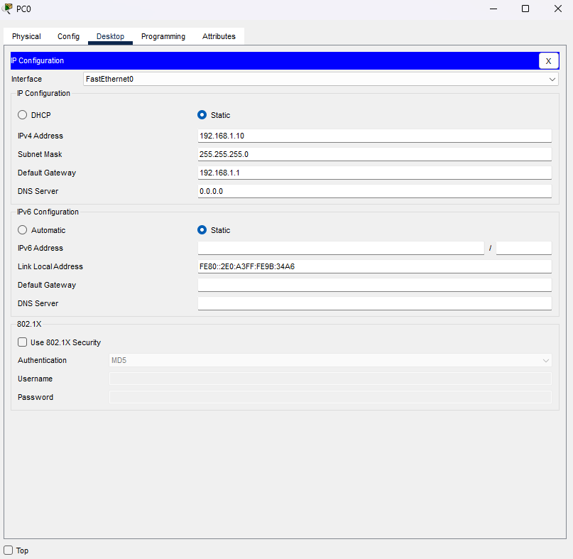
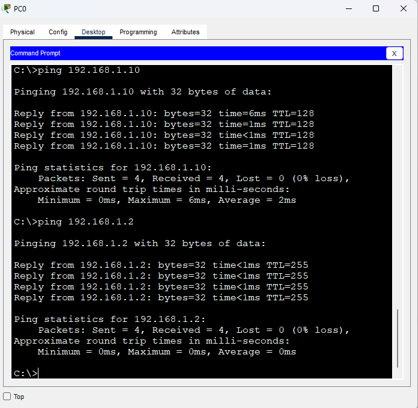
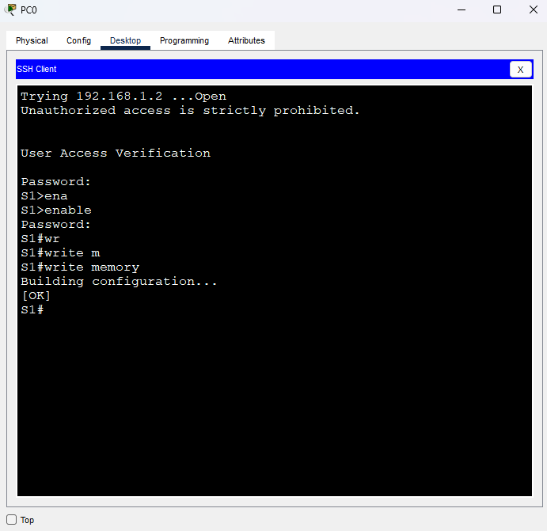

# Лабораторная работа. Базовая настройка коммутатора
## Топология

## Таблица адресации
|Устройство|Интерфейс|IP адрес   |
| ------------ | ------------ | ------------ |
| S1|Vlan 1|192.168.1.2|
|   |   |255.255.255.0|
| PC-PT|NIC|192.168.1.10|
|   |   |255.255.255.0|
## Задачи
#### Часть 1. Проверка конфигурации коммутатора по умолчанию
#### Часть 2. Создание сети и настройка основных параметров устройства
•	Настройте базовые параметры коммутатора. 
•	Настройте IP-адрес для ПК.
#### Часть 3. Проверка сетевых подключений
•	Отобразите конфигурацию устройства. 
•	Протестируйте сквозное соединение, отправив эхо-запрос. 
•	Протестируйте возможности удаленного управления с помощью Telnet.
## Часть 1. Создание сети и проверка настроек коммутатора по умолчанию
В первой части лабораторной работы вам предстоит настроить топологию сети и проверить настройку коммутатора по умолчанию.
### Шаг 1. Создайте сеть согласно топологии.
a.	Подсоедините консольный кабель, как показано в топологии. На данном этапе не подключайте кабель Ethernet компьютера PC-A. 
b.	Установите консольное подключение к коммутатору с компьютера PC-A с помощью Tera Term или другой программы эмуляции терминала.

#### Вопрос  
Почему нужно использовать консольное подключение для первоначальной настройки коммутатора? Почему нельзя подключиться к коммутатору через Telnet или SSH? 
#### Ответ  
На текущем этапе, не задан IP адрес, а также не заданы настройки авторизации для данных протоколов
### Шаг 2. Проверьте настройки коммутатора по умолчанию. 
a.	Предположим, что коммутатор не имеет файла конфигурации, сохраненного в энергонезависимой памяти (NVRAM). Консольное подключение к коммутатору с помощью Tera Term или другой программы эмуляции терминала предоставит доступ к командной строке пользовательского режима EXEC в виде Switch>. Введите команду enable, чтобы войти в привилегированный режим EXEC.
Откройте окно конфигурации
Обратите внимание, что измененная в конфигурации строка будет отражать привилегированный режим EXEC.
Убедитесь, что на коммутаторе находится пустой файл конфигурации по умолчанию, с помощью команды show running-config привилегированного режима EXEC.  Если конфигурационный файл был предварительно сохранен, его нужно удалить. В зависимости от модели коммутатора и версии IOS ваша конфигурация может слегка отличаться. Тем не менее, настроенных паролей или IP-адресов в конфигурации быть не должно. Выполните очистку настроек и перезагрузите коммутатор, если ваш коммутатор имеет настройки, отличные от настроек по умолчанию. 

            Switch#show running-config
            Building configuration...
            Current configuration : 1080 bytes<
            !
            version 15.0
            no service timestamps log datetime msec
            no service timestamps debug datetime msec
            no service password-encryption
            !
            hostname Switch
            !
            !
            !
            !
            !
            !
            spanning-tree mode pvst
            spanning-tree extend system-id
            !
            interface FastEthernet0/1
            !
            interface FastEthernet0/2
            !
            interface FastEthernet0/3
            !
            interface FastEthernet0/4
            !
            interface FastEthernet0/5
            !
            interface FastEthernet0/6
            !
            interface FastEthernet0/7
            !
            interface FastEthernet0/8
            !
            interface FastEthernet0/9
            !
            interface FastEthernet0/10
            !
            interface FastEthernet0/11
            !
            interface FastEthernet0/12
            !
            interface FastEthernet0/13
            !
            interface FastEthernet0/14
            !
            interface FastEthernet0/15 
            !
            interface FastEthernet0/16 
            !
            interface FastEthernet0/17 
            !
            interface FastEthernet0/18 
            !
            interface FastEthernet0/19 
            !
            interface FastEthernet0/20 
            !
            interface FastEthernet0/21 
            !
            interface FastEthernet0/22 
            !
            interface FastEthernet0/23 
            !
            interface FastEthernet0/24 
            !
            interface GigabitEthernet0/1 
            !
            interface GigabitEthernet0/2 
            !
            interface Vlan1
            no ip address
            shutdown
            !
            !
            !
            !
            line con 0
            !
            line vty 0 4
            login
            line vty 5 15
            login
            !
            !
            !
            !
            end
b.	Изучите текущий файл running configuration.
#### Вопрос  
Сколько интерфейсов FastEthernet имеется на коммутаторе 2960? 
#### Ответ  
24
#### Вопрос  
Сколько интерфейсов Gigabit Ethernet имеется на коммутаторе 2960? 
#### Ответ  
2
#### Вопрос  
Каков диапазон значений, отображаемых в vty-линиях? 
#### Ответ  
0-15 
c.	Изучите файл загрузочной конфигурации (startup configuration), который содержится в энергонезависимом ОЗУ (NVRAM). 

Switch#show startup-config 
startup-config is not present 
#### Вопрос  
Почему появляется это сообщение? 
#### Овтет  
В энергонезависимой памяти отсутствует сохраненная конфигурация, поскольку на текущий момент конфигурация не сохранялась 

d.	Изучите характеристики SVI для VLAN 1. 
#### Вопрос  
Назначен ли IP-адрес сети VLAN 1? 
#### Ответ  
Нет, не назначен
#### Вопрос  
Какой MAC-адрес имеет SVI? Возможны различные варианты ответов. 
#### Ответ  
            Switch#show interfaces vlan 1  
            Hardware is CPU Interface, address is 0001.c748.a85d (bia 0001.c748.a85d) 
#### Вопрос  
Данный интерфейс включен?
#### Ответ  
Нет, не включен 

e.	Изучите IP-свойства интерфейса SVI сети VLAN 1.
#### Вопрос  
Какие выходные данные вы видите?
#### Ответ  
Название Vlan1 
Ip адрес Не задан 
Метод получения адреса Ручной 
Статус интерфейса administratively down 
Протокол down 

f. Подсоедините кабель Ethernet компьютера PC-A к порту 6 на коммутаторе и изучите IP-свойства интерфейса SVI сети VLAN 1. Дождитесь согласования параметров скорости и дуплекса между коммутатором и ПК. 
#### Вопрос  
Какие выходные данные вы видите?
#### Ответ  
Данные не изменились
g.	Изучите сведения о версии ОС Cisco IOS на коммутаторе.
#### Вопрос  
Под управлением какой версии ОС Cisco IOS работает коммутатор? 
#### Ответ  
            Switch#show version  
            Cisco IOS Software, C2960 Software (C2960-LANBASEK9-M), Version 15.0(2)SE4, RELEASE SOFTWARE (fc1) 
#### Вопрос  
Как называется файл образа системы? 
#### Ответ  
            System image file is "flash:c2960-lanbasek9-mz.150-2.SE4.bin" 
h.Изучите свойства по умолчанию интерфейса FastEthernet, который используется компьютером PC-A. 
Switch# show interface f0/6 
#### Вопрос  
Интерфейс включен или выключен? 
#### Ответ  
Включен 
#### Вопрос  
Что нужно сделать, чтобы включить интерфейс? 
#### Ответ  
Интерфейс включился после соединения физического соединения с ПК 
#### Вопрос  
Какой MAC-адрес у интерфейса? 
#### Ответ  
            Switch#show interface f0/6
            FastEthernet0/6 is up, line protocol is up (connected)
            Hardware is Lance, address is 0002.1681.9306 (bia 0002.1681.9306)
#### Вопрос  
Какие настройки скорости и дуплекса заданы в интерфейсе? 
#### Ответ  
Full-duplex, 100Mb/s
i.	Изучите флеш-память.
Выполните одну из следующих команд, чтобы изучить содержимое флеш-каталога.
Switch# show flash 
Switch# dir flash: 
В конце имени файла указано расширение, например .bin. Каталоги не имеют расширения файла.
#### Вопрос  
Какое имя присвоено образу Cisco IOS? 
#### Ответ  
2960-lanbasek9-mz.150-2.SE4.bin 

## Часть 2. Настройка базовых параметров сетевых устройств 
Во второй части необходимо будет настроить основные параметры коммутатора и компьютера.
### Шаг 1. Настройте базовые параметры коммутатора.
a.	В режиме глобальной конфигурации скопируйте следующие базовые параметры конфигурации и вставьте их в файл на коммутаторе S1. 
no ip domain-lookup 
hostname S1 
service password-encryption 
enable secret class 
banner motd #Unauthorized access is strictly prohibitsed. # 
b.	Назначьте IP-адрес интерфейсу SVI на коммутаторе. Благодаря этому вы получите возможность удаленного управления коммутатором.
Прежде чем вы сможете управлять коммутатором S1 удаленно с компьютера PC-A, коммутатору нужно назначить IP-адрес. Согласно конфигурации по умолчанию коммутатором можно управлять через VLAN 1.

            S1(config)#interface vlan 1
            S1(config-if)#ip address 192.168.1.2 255.255.255.0
c.	Доступ через порт консоли также следует ограничить  с помощью пароля. Используйте cisco в качестве пароля для входа в консоль в этом задании. Конфигурация по умолчанию разрешает все консольные подключения без пароля. Чтобы консольные сообщения не прерывали выполнение команд, используйте параметр logging synchronous.

            line con 0
            password 7 0822455D0A16
            logging synchronous
            login

d.	Настройте каналы виртуального соединения для удаленного управления (vty), чтобы коммутатор разрешил доступ через Telnet. Если не настроить пароль VTY, будет невозможно подключиться к коммутатору по протоколу Telnet.

            line vty 0 4
            password 7 0822455D0A16
            login
            transport input telnet
#### Вопрос  
Для чего нужна команда login?
#### Ответ  
Включает проверку пароля при подключении 
### Шаг 2. Настройте IP-адрес на компьютере PC-A.
Назначьте компьютеру IP-адрес и маску подсети в соответствии с таблицей адресации.
1)	Перейдите в Панель управления. (Control Panel)
2)	В представлении «Категория» выберите « Просмотр состояния сети и задач».
3)	Щелкните Изменение параметров адаптера на левой панели.
4)	Щелкните правой кнопкой мыши интерфейс Ethernet и выберите «Свойства» .
5)	Выберите Протокол Интернета версии 4 (TCP/IPv4) > Свойства.
6)	Выберите Использовать следующий IP-адрес и введите IP-адрес и маску подсети  и нажмите ОК.

## Часть 3. Проверка сетевых подключений
В третьей части лабораторной работы вам предстоит проверить и задокументировать конфигурацию коммутатора, протестировать сквозное соединение между компьютером PC-A и коммутатором S1, а также протестировать возможность удаленного управления коммутатором.
### Шаг 1. Отобразите конфигурацию коммутатора.
            S1#show running-config 
            Building configuration...
            
            Current configuration : 1350 bytes
            !
            version 15.0
            no service timestamps log datetime msec
            no service timestamps debug datetime msec
            service password-encryption
            !
            hostname S1
            !
            enable secret 5 $1$mERr$9cTjUIEqNGurQiFU.ZeCi1
            !
            !
            !
            no ip domain-lookup
            !
            !
            !
            spanning-tree mode pvst
            spanning-tree extend system-id
            !
            interface FastEthernet0/1
            !
            interface FastEthernet0/2
            !
            interface FastEthernet0/3
            !
            interface FastEthernet0/4
            !
            interface FastEthernet0/5
            !
            interface FastEthernet0/6
            !
            interface FastEthernet0/7
            !
            interface FastEthernet0/8
            !
            interface FastEthernet0/9
            !
            interface FastEthernet0/10
            !
            interface FastEthernet0/11
            !
            interface FastEthernet0/12
            !
            interface FastEthernet0/13
            !
            interface FastEthernet0/14
            !
            interface FastEthernet0/15
            !
            interface FastEthernet0/16
            !
            interface FastEthernet0/17
            !
            interface FastEthernet0/18
            !
            interface FastEthernet0/19
            !
            interface FastEthernet0/20
            !
            interface FastEthernet0/21
            !
            interface FastEthernet0/22
            !
            interface FastEthernet0/23
            !
            interface FastEthernet0/24
            !
            interface GigabitEthernet0/1
            !
            interface GigabitEthernet0/2
            !
            interface Vlan1
             ip address 192.168.1.2 255.255.255.0
            !
            banner motd ^C
            Unauthorized access is strictly prohibited. ^C
            !
            !
            !
            line con 0
             password 7 0822455D0A16
             logging synchronous
             login
            !
            line vty 0 4
             password 7 0822455D0A16
             login
             transport input telnet
            line vty 5 15
             login
            !
            !
            !
            !
            end
b.	Проверьте параметры VLAN 1.
S1# show interface vlan 1 
#### Вопрос  
Какова полоса пропускания этого интерфейса? 
#### Ответ  
100 Мбит/с 

###Шаг 2. Протестируйте сквозное соединение, отправив эхо-запрос.
a.	В командной строке компьютера PC-A с помощью утилиты ping проверьте связь сначала с адресом PC-A. 
C:\> ping 192.168.1.10  
b.	Из командной строки компьютера PC-A отправьте эхо-запрос на административный адрес интерфейса SVI коммутатора S1. 
C:\> ping 192.168.1.2 
Поскольку компьютеру PC-A нужно преобразовать МАС-адрес коммутатора S1 с помощью ARP, время ожидания передачи первого пакета может истечь. Если эхо-запрос не удается, найдите и устраните неполадки базовых настроек устройства. Проверьте как физические кабели, так и логическую адресацию.

### Шаг 3. Проверьте удаленное управление коммутатором S1.
После этого используйте удаленный доступ к устройству с помощью Telnet. В этой лабораторной работе устройства PC-A и S1 расположены рядом. В производственной сети коммутатор может находиться в коммутационном шкафу на последнем этаже, в то время как административный компьютер находится на первом этаже. На данном этапе вам предстоит использовать Telnet для удаленного доступа к коммутатору S1 через его административный адрес SVI. Telnet — это не безопасный протокол, но вы можете использовать его для проверки удаленного доступа. В случае с Telnet вся информация, включая пароли и команды, отправляется через сеанс в незашифрованном виде. В последующих лабораторных работах вы будете использовать протокол SSH для удаленного доступа к сетевым устройствам. 
a.	Откройте Tera Term или другую программу эмуляции терминала с возможностью Telnet.  
b.	Выберите сервер Telnet и укажите адрес управления SVI для подключения к S1.  Пароль: cisco. 
c.	После ввода пароля cisco вы окажетесь в командной строке пользовательского режима. Для перехода в исполнительский режим EXEC введите команду enable и используйте секретный пароль class. 
d.	Сохраните конфигурацию. 
e.	Чтобы завершить сеанс Telnet, введите exit. 

